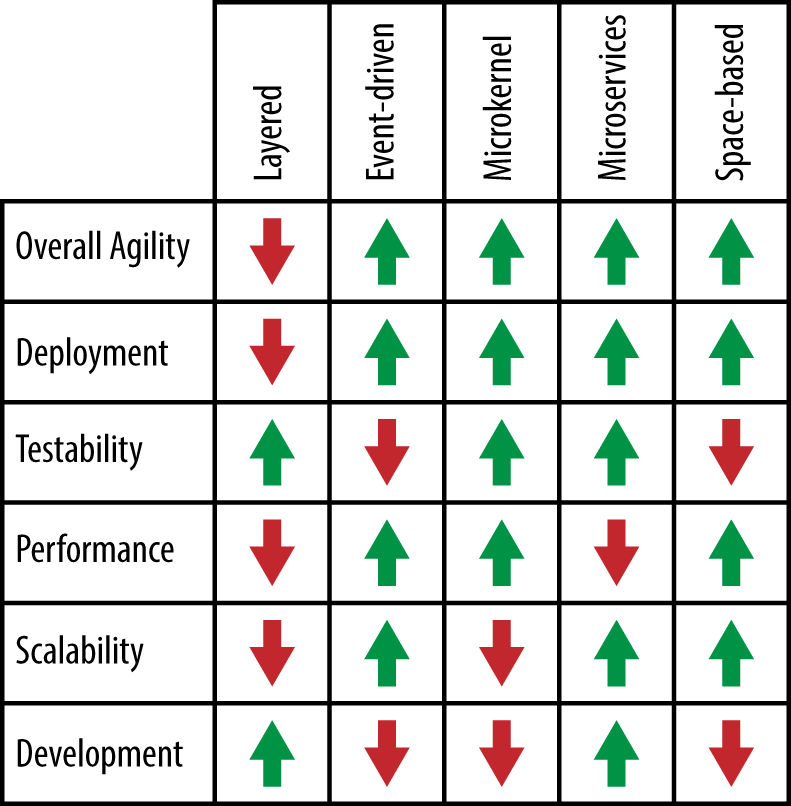

# 附录A 模式分析概要

图 A-1 总结了本报告中描述的每种架构模式的模式分析评分。此总结将帮助您确定哪种模式最适合您的实际情况。例如，如果您的主要架构关注点是可扩展性，您可以查看此图表，了解事件驱动模式、微服务模式和基于空间的模式可能都是不错的选择。同样，如果您为应用程序选择分层架构模式，您可以参考此图表，了解部署、性能和可扩展性可能是您架构中的风险领域。

*Figure A-1. Pattern-analysis summary*

虽然这张图表可以帮助您选择合适的架构模式，但选择架构模式时需要考虑的因素远不止这些。您必须分析环境的各个方面，包括基础设施支持、开发人员技能、项目预算、项目截止日期和应用程序规模（仅举几例）。选择合适的架构模式至关重要，因为一旦架构建立起来，更改起来就非常困难（而且成本高昂）。

