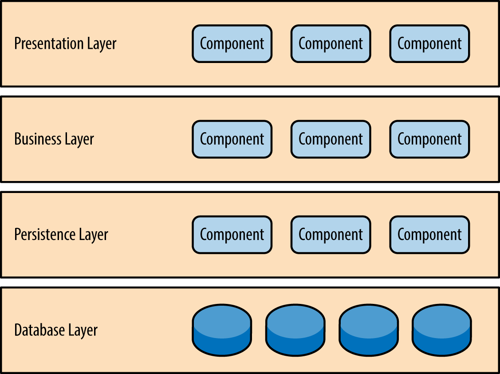
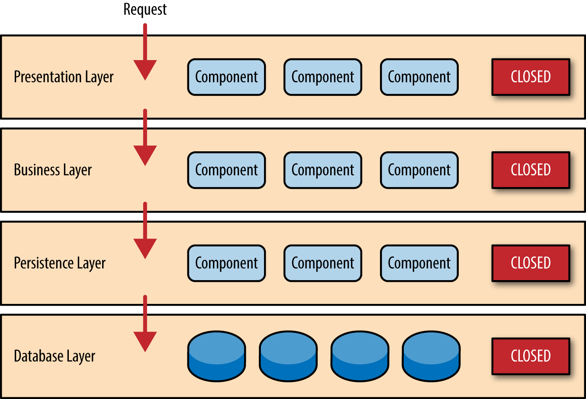
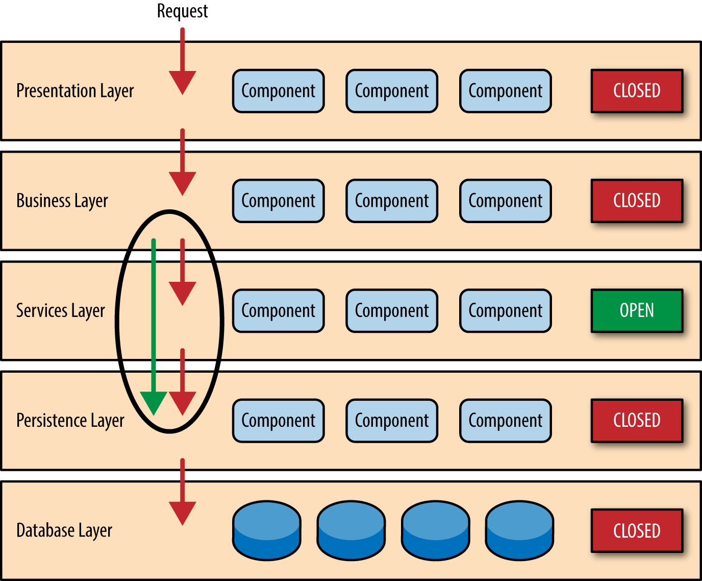
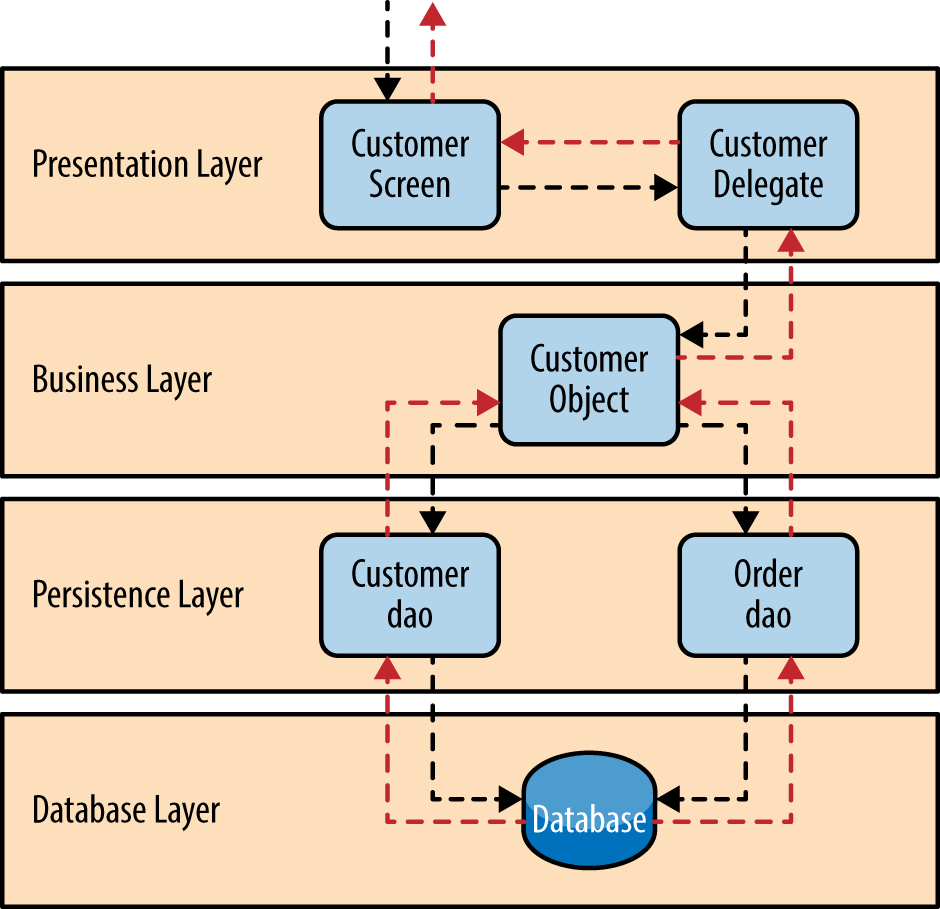

# 第一章 分层架构 (Layered Architecture)

最常见的架构模式是分层架构模式，也称为n层架构模式。这种模式是大多数Java EE应用程序的事实标准，因此被大多数架构师、设计师和开发人员广泛认可。分层架构模式与大多数公司传统的IT沟通和组织结构高度契合，使其成为大多数业务应用程序开发工作的理想选择。

## 模式描述

分层架构模式中的组件被组织成水平层，每一层在应用程序中扮演特定角色（例如，表示层逻辑或​​业务逻辑）。虽然分层架构模式并未规定必须存在的层数和类型，但大多数分层架构都包含四个标准层：表示层、业务层、持久层和数据库层（图 1-1）。在某些情况下，业务层和持久层会合并为一个业务层，尤其是在持久层逻辑（例如 SQL 或 HSQL）嵌入到业务层组件中时。因此，较小的应用程序可能只有三层，而较大、更复杂的业务应用程序可能包含五层或更多层。

分层架构模式中的每一层在应用程序中都扮演着特定的角色并承担着特定的职责。例如，表示层负责处理所有用户界面和浏览器通信逻辑，而业务层则负责执行与请求相关的特定业务规则。架构中的每一层都对满足特定业务请求所需的工作进行了抽象。例如，表示层无需了解或关心如何获取客户数据；它只需要以特定格式在屏幕上显示这些信息。同样，业务层无需关心如何格式化客户数据以在屏幕上显示，甚至无需关心客户数据的来源；它只需要从持久层获取数据，对数据执行业务逻辑（例如，计算值或聚合数据），并将这些信息传递给表示层。

*图 1-1. 分层架构模式*

分层架构模式的强大之处在于组件间*关注点*的*分离*。特定层内的组件只处理与该层相关的逻辑。例如，表示层中的组件只处理表示逻辑，而业务层中的组件只处理业务逻辑。这种组件分类方式使得在架构中构建有效的角色和职责模型变得容易，并且由于组件接口定义明确且组件范围有限，也使得使用该架构模式的应用程序的开发、测试、管理和维护更加便捷。

## 关键概念

如图 1-2 所示，架构中的每一层都被标记为*封闭*。这是分层架构模式中一个非常重要的概念。“封闭”层意味着，当请求从一层传递到下一层时，它必须先经过其下一层才能到达更下一层。例如，来自表示层的请求必须先经过业务层，然后到达持久层，最终才能到达数据库层。

*图 1-2. 封闭层和请求访问*

那么，为什么不允许表示层直接访问持久层或数据库层呢？毕竟，从表示层直接访问数据库比通过一堆不必要的层来检索或保存数据库信息要快得多。这个问题的答案在于一个关键概念，即*隔离层*。

隔离层概念意味着，架构中某一层的更改通常不会影响其他层的组件：更改仅限于该层内的组件，以及可能相关的其他层（例如包含 SQL 的持久层）。如果允许表示层直接访问持久层，那么对持久层中 SQL 的更改将同时影响业务层和表示层，从而导致应用程序高度耦合，组件之间存在大量相互依赖关系。这种架构的更改将变得非常困难且成本高昂。

隔离层概念还意味着每一层都独立于其他层，因此对架构中其他层的内部运作知之甚少或一无所知。为了理解这一概念的强大之处和重要性，不妨考虑一下将表示层框架从 JSP（Java Server Pages）迁移到 JSF（Java Server Faces）的大规模重构工作。假设表示层和业务层之间使用的契约（例如模型）保持不变，那么业务层不会受到重构的影响，并且完全独立于表示层使用的用户界面框架类型。

虽然封闭层有助于实现多层隔离，从而有助于隔离架构内部的变更，但在某些情况下，某些层保持开放是合理的。例如，假设您想在架构中添加一个共享服务层，其中包含业务层组件可以访问的公共服务组件（例如，数据和字符串实用程序类或审计和日志类）。在这种情况下，创建服务层通常是一个好主意，因为从架构上讲，它将对共享服务的访问限制在业务层（而不是表示层）。如果没有单独的服务层，架构上就没有任何东西可以限制表示层访问这些公共服务，这使得管理这种访问限制变得困难。

在这个例子中，新的服务层很可能位于业务层之下，以表明该服务层中的组件无法从表示层访问。然而，这带来了一个问题：业务层现在必须通过服务层才能到达持久层，这完全不合理。这是分层架构中一个由来已久的问题，可以通过在架构中创建开放层来解决。

如图 1-3 所示，本例中的服务层被标记为开放层，这意味着请求可以绕过该开放层，直接到达其下方的层。在下面的例子中，由于服务层是开放的，业务层现在可以绕过它，直接到达持久层，这完全合理。

*图 1-3. 开放层和请求流*

利用开放层和封闭层的概念有助于定义架构层与请求流之间的关系，并为设计人员和开发人员提供必要的信息，以了解架构中各个层的访问限制。如果未能记录或正确沟通架构中哪些层是开放的、哪些层是封闭的（以及原因），通常会导致架构耦合过紧且脆弱，难以测试、维护和部署。

## 模式示例

为了说明分层架构的工作原理，请考虑业务用户请求检索特定客户信息的情况，如图 1-4 所示。黑色箭头表示请求向下流向数据库以检索客户数据，红色箭头表示响应向上流向屏幕以显示数据。在本例中，客户信息包含客户数据和订单数据（客户下的订单）。

*客户屏幕*负责接收请求并显示客户信息。它并不知道数据的位置、检索方式，也不知道获取数据需要查询多少个数据库表。客户屏幕收到获取特定客户信息的请求后，会将该请求转发给*客户委托*模块。该模块负责了解业务层中哪些模块可以处理该请求，以及如何访问这些模块以及需要哪些数据（即契约）。业务层中的*客户对象*负责聚合业务请求（在本例中为获取客户信息）所需的所有信息。该模块调用持久层中的*客户数据访问对象 (DAO)* 模块获取客户数据，并调用*订单数据访问对象 (DAO)* 模块获取订单信息。这些模块依次执行 SQL 语句来检索相应的数据，并将其返回给业务层中的客户对象。客户对象接收到数据后，对其进行聚合，并将聚合后的信息返回给客户委托模块，客户委托模块再将数据传递给客户页面，最终呈现给用户。

*图 1-4. 分层架构示例*

从技术角度来看，这些模块的实现方式可谓五花八门。例如，在 Java 平台上，客户界面可以是一个 Java Server Faces (JSF) 界面，并结合客户委托作为托管 bean 组件。业务层中的客户对象可以是本地 Spring bean，也可以是远程 EJB3 bean。前面示例中展示的数据访问对象可以实现为简单的 POJO（Plain Old Java Objects）、MyBatis XML Mapper 文件，甚至可以是封装原始 JDBC 调用或 Hibernate 查询的对象。从 Microsoft 平台的角度来看，客户界面可以是一个 ASP（Active Server Pages）模块，它使用 .NET 框架访问业务层中的 C# 模块，而客户和订单数据访问模块则以 ADO（ActiveX 数据对象）的形式实现。

## 注意事项

分层架构模式是一种可靠的通用模式，因此对于大多数应用程序来说，它是一个很好的起点，尤其是在您不确定哪种架构模式最适合您的应用程序时。然而，从架构角度来看，选择这种模式时需要考虑以下几点。

首先要警惕的是所谓的*架构陷阱反模式*。这种反模式指的是请求在架构的多个层级间简单地传递，每一层几乎没有或根本没有执行任何逻辑。例如，假设表示层响应用户请求检索客户数据。表示层将请求传递给业务层，业务层又将请求传递给持久层，持久层随后向数据库层发出简单的 SQL 调用来检索客户数据。然后，数据就这样一路向上传递，没有进行任何额外的处理或逻辑运算来聚合、计算或转换数据。

任何分层架构都至少会存在一些属于“架构陷阱”反模式的情况。关键在于分析属于这种情况的请求所占的比例。通常，遵循 80/20 法则是判断是否遇到“架构陷阱”反模式的有效方法。通常情况下，大约 20% 的请求是简单的直通处理，而 80% 的请求则包含一些业务逻辑。但是，如果发现这个比例颠倒过来，大部分请求都是简单的直通处理，那么您可能需要考虑开放部分架构层。需要注意的是，由于缺乏层隔离，变更控制会更加困难。

分层架构模式的另一个缺点是，即使将表示层和业务层拆分成独立的可部署单元，它也倾向于构建单体应用。虽然这对于某些应用来说可能不是问题，但它确实会在部署、整体健壮性和可靠性、性能以及可扩展性方面带来一些潜在问题。

## 模式分析

下表列出了分层架构模式常见架构特征的评级和分析。每个特征的评级基于该特征作为典型模式实现能力的自然倾向，以及该模式的普遍认知。如需了解此模式与本报告中其他模式的并排比较，请参阅本报告末尾的附录 A。

***整体敏捷性***
> *等级:* 低  
*分析:* 整体敏捷性是指快速响应不断变化的环境的能力。虽然可以通过这种模式的隔离层来隔离变更，但由于大多数实现的单体特性以及组件之间通常存在的紧密耦合，在这种架构模式下进行变更仍然繁琐且耗时。

***易于部署***
> *等级:* 低  
*分析:* 根据您实现此模式的方式，部署可能会成为一个问题，尤其对于大型应用程序而言。对组件的微小更改都可能需要重新部署整个应用程序（或应用程序的大部分），导致部署需要在非工作时间或周末进行规划、安排和执行。因此，此模式不易融入持续交付流水线，进一步降低了部署的整体评分。

***可测试性***
> *等级:* 高  
*分析:* 由于组件属于架构中的特定层，其他层可以被模拟（mocked）或存根化（stubbed），因此这种模式相对容易测试。开发人员可以模拟展示组件或屏幕，从而将测试隔离在业务组件内部，也可以模拟业务层来测试特定的屏幕功能。

***性能***
> *等级:* 低  
*分析:* 虽然某些分层架构确实可以表现良好，但由于需要通过架构的多个层来满足业务请求，效率低下，因此这种模式并不适合高性能应用程序。

***可扩展性***
> *等级:* 低  
*分析:* 由于这种架构模式倾向于紧密耦合和单体式实现，因此使用这种架构模式构建的应用程序通常难以扩展。虽然可以通过将各层拆分到独立的物理部署中，或者将整个应用程序复制到多个节点来扩展分层架构，但总体而言，其粒度过大，导致扩展成本高昂。

***易于开发***
> *等级:* 高  
*分析:* 开发便捷性得分相对较高，主要是因为这种模式广为人知且实施起来并不复杂。由于大多数公司在开发应用程序时会按层级（表示层、业务层、数据库层）划分技能，因此这种模式自然而然地成为大多数商业应用程序开发的首选。公司沟通和组织结构与其软件开发方式之间的联系，正是所谓的康威定律。您可以搜索“康威定律”来了解更多关于这一有趣关联的信息。

