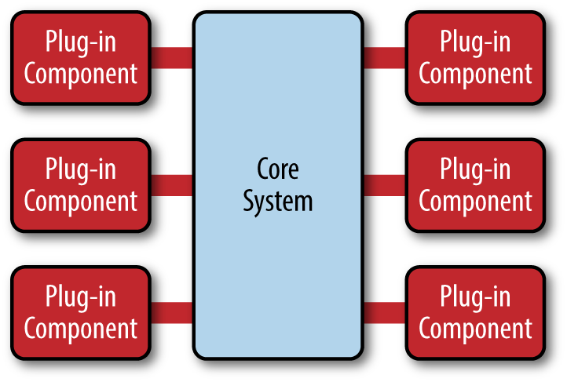
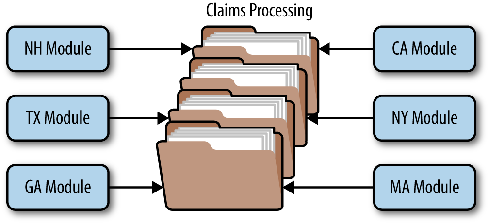

# 第三章 微内核架构 (Microkernel Architecture)

微内核架构模式（有时也称为插件架构模式）是实现产品型应用程序的理想模式。产品型应用程序是指像典型的第三方产品一样，打包并以不同版本提供下载的应用程序。然而，许多公司也会开发并发布其内部业务应用程序，这些应用程序也像软件产品一样，包含版本、发行说明和可插拔功能。这些应用程序也非常适合采用这种模式。微内核架构模式允许您将额外的应用程序功能作为插件添加到核心应用程序中，从而提供可扩展性以及功能分离和隔离。

## 模式描述

微内核架构模式由两种类型的架构组件组成：*核心系统*和*插件模块*。应用程序逻辑被划分到独立的插件模块和基本的核心系统中，从而提供应用程序功能和自定义处理逻辑的可扩展性、灵活性和隔离性。图 3-1 展示了基本的微内核架构模式。

微内核架构模式的核心系统通常只包含使系统运行所需的最小功能。许多操作系统都实现了微内核架构模式，这也是该模式名称的由来。从业务应用的角度来看，核心系统通常被定义为通用业务逻辑，不包括用于特殊情况、特殊规则或复杂条件处理的自定义代码。

*图 3-1. 微内核架构模式*

插件模块是独立的组件，包含专门的处理功能、附加特性和自定义代码，旨在增强或扩展核心系统，从而提供额外的业务能力。通常，插件模块应彼此独立，但当然也可以设计需要其他插件才能运行的插件。无论哪种方式，都应尽量减少插件之间的通信，以避免依赖性问题。

核心系统需要了解哪些插件模块可用以及如何访问它们。一种常见的实现方式是通过某种插件注册表。该注册表包含每个插件模块的信息，包括其名称、数据契约和远程访问协议详情（取决于插件与核心系统的连接方式）。例如，一个用于标记高风险税务审计项目的税务软件插件可能有一个注册表项，其中包含服务名称（AuditChecker）、数据契约（输入数据和输出数据）以及契约格式（XML）。如果插件是通过 SOAP 访问的，那么它可能还包含 WSDL（Web 服务定义语言）。

插件模块可以通过多种方式连接到核心系统，包括 OSGi（开放服务网关倡议）、消息传递、Web 服务，甚至直接点对点绑定（即对象实例化）。您使用的连接类型取决于您正在构建的应用程序类型（小型产品或大型企业应用程序）以及您的具体需求（例如，单点部署或分布式部署）。架构模式本身并未指定任何实现细节，仅要求插件模块必须彼此独立。

插件模块和核心系统之间的契约可以是标准契约，也可以是自定义契约。自定义契约通常用于插件组件由第三方开发，而您无法控制插件使用的契约的情况。在这种情况下，通常会在插件契约和您的标准契约之间创建一个适配器，这样核心系统就不需要为每个插件编写专门的代码。创建标准契约（通常通过 XML 或 Java Map 实现）时，务必从一开始就制定版本控制策略。

## 模式示例

Eclipse IDE 或许是微内核架构的最佳示例。下载基础版 Eclipse 产品，你得到的不过是一个功能强大的编辑器。然而，一旦你开始添加插件，它就变成了一个高度可定制且功能强大的产品。互联网浏览器是另一个使用微内核架构的常见产品示例：查看器和其他插件添加了基础浏览器（即核心系统）本身不具备的额外功能。

基于产品的软件示例不胜枚举，那么大型企业应用程序又如何呢？微内核架构同样适用于这些情况。为了说明这一点，我们再举一个保险公司的例子，这次是关于保险理赔处理的例子。

理赔处理是一个非常复杂的过程。每个州对于保险理赔中允许和不允许的情况都有不同的规则和规定。例如，有些州允许在挡风玻璃被石子损坏的情况下免费更换挡风玻璃，而其他州则不允许。这使得标准的理赔流程几乎包含了无限多种情况。

不出所料，大多数保险理赔应用程序都利用庞大而复杂的规则引擎来处理大部分复杂性。然而，这些规则引擎可能会逐渐演变成复杂的"大泥球（Big Ball of Mud）"，一条规则的更改会影响其他规则，或者即使只是简单的规则更改也需要大批分析师、开发人员和测试人员。使用微内核架构模式可以解决许多此类问题。

图 3-2 中的文件夹堆栈代表理赔处理的核心系统。它包含保险公司处理理赔所需的基本业务逻辑，但没有任何自定义处理。每个插件模块包含该州的特定规则。在本例中，插件模块可以使用自定义源代码或独立的规则引擎实例来实现。无论采用何种实现方式，关键在于特定州的规则和处理与核心理赔系统是分离的，可以添加、删除和更改，而对核心系统的其余部分或其他插件模块几乎没有影响。

*图 3-2. 微内核架构示例*

## 注意事项

微内核架构模式的一大优势在于它可以嵌入到其他架构模式中，或作为其他架构模式的一部分使用。例如，如果该模式解决了应用程序中某个特定易变区域的问题，您可能会发现无法完全使用该模式来实现整个架构。在这种情况下，您可以将微内核架构模式嵌入到您正在使用的其他模式中（例如，分层架构）。类似地，上一节中关于事件驱动架构的事件处理器组件也可以使用微内核架构模式来实现。

微内核架构模式为演进式设计和增量开发提供了强大的支持。您可以先构建一个稳固的核心系统，然后随着应用程序的演进逐步添加特性和功能，而无需对核心系统进行重大更改。

对于基于产品的应用程序，微内核架构模式应该始终是初始架构的首选，尤其适用于那些需要随着时间的推移发布附加功能并希望控制哪些用户可以使用哪些功能的产品。如果随着时间的推移，你发现这种模式不能满足你的所有要求，你可以随时将应用程序重构为更适合你特定要求的另一种架构模式。

## 模式分析

下表列出了微内核架构模式常见架构特征的评级和分析。每个特征的评级基于该特征作为典型实现方案的自然倾向，以及该模式的普遍认知。如需了解此模式与本报告中其他模式的并排比较，请参阅本报告末尾的附录 A。

***整体敏捷性***
> *等级:* 高  
*分析:* 整体敏捷性是指快速响应不断变化的环境的能力。变更大多可以隔离，并通过松耦合的插件模块快速实施。一般来说，大多数微内核架构的核心系统往往能够迅速稳定下来，因此相当健壮，随着时间的推移所需的变更也较少。

***易于部署***
> *等级:* 高  
*分析:*根据模式的实现方式，插件模块可以在运行时动态添加到核心系统（例如，热部署），从而最大限度地减少部署期间的停机时间。

***可测试性***
> *等级:* 高  
*分析:* 插件模块可以单独进行测试，并且可以通过核心系统轻松模拟，从而演示或原型化特定功能，而无需对核心系统进行太多或完全的更改。

***性能***
> *等级:* 高  
*分析:* 虽然微内核模式本身并不直接适用于高性能应用，但通常情况下，大多数采用微内核架构模式构建的应用都能取得良好的性能，因为您可以自定义和精简应用，使其仅包含所需的功能。JBoss 应用服务器就是一个很好的例子：凭借其插件式架构，您可以精简应用服务器，使其仅包含所需的功能，从而移除诸如远程访问、消息传递和缓存等消耗大量内存、CPU 和线程并降低应用服务器速度的昂贵且未使用的功能。

***可扩展性***
> *等级:* 低  
*分析:* 由于大多数微内核架构实现都是基于产品的，且规模通常较小，因此它们被实现为单个单元，因而可扩展性不高。根据插件模块的实现方式，有时可以在插件功能级别提供可扩展性，但总体而言，这种模式并不以构建高可扩展性应用程序而闻名。

***易于开发***
> *等级:* 低  
*分析:* 微内核架构需要精心设计和契约治理，因此实现起来相当复杂。契约版本控制、内部插件注册表、插件粒度以及插件连接方式的多样性，都增加了实现这种模式的复杂性。

