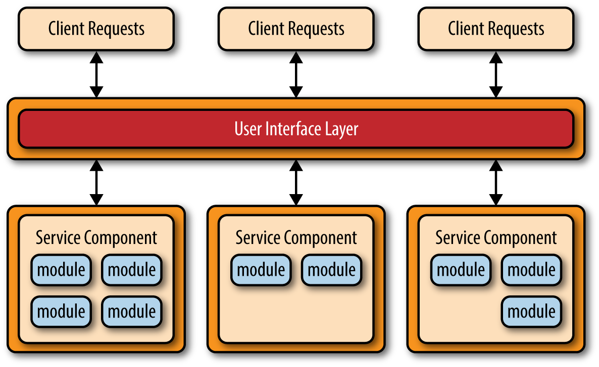
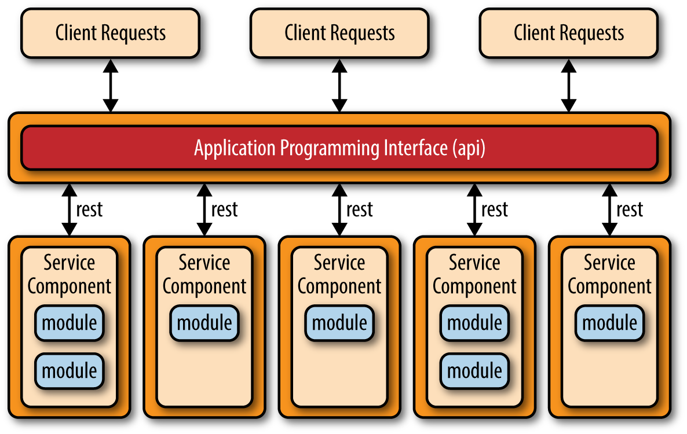
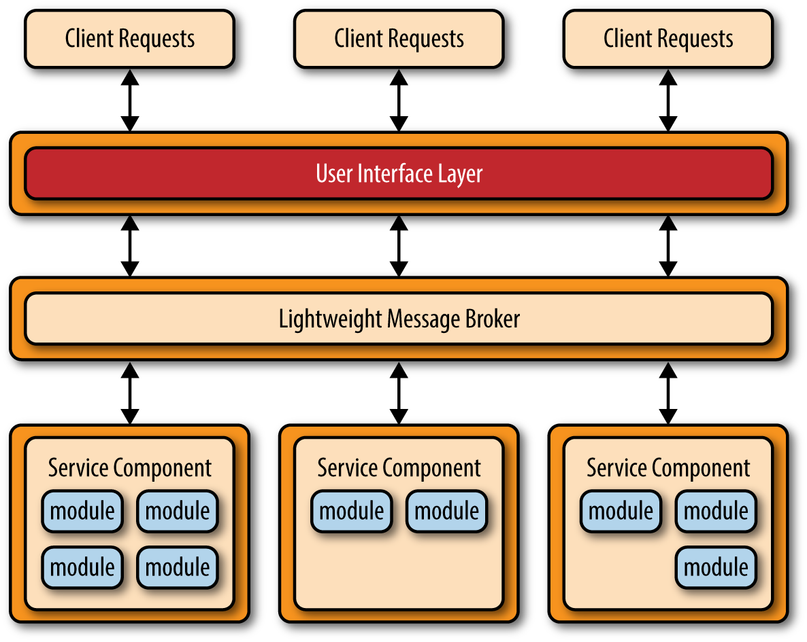

# 第四章 微服务架构模式 (Microservices Architecture Pattern)

微服务架构模式正迅速成为业界主流，成为单体应用和面向服务架构之外的可行替代方案。由于这种架构模式仍在不断发展，业界对于其本质和实现方式仍存在诸多困惑。本报告的这一部分将为您提供理解这一重要架构模式优势（以及权衡取舍）所需的关键概念和基础知识，并帮助您判断它是否适合您的应用。

## 模式描述

无论您选择何种拓扑结构或实现方式，该架构模式都遵循一些通用的核心概念。第一个概念是独立部署单元。如图 4-1 所示，微服务架构的每个组件都作为独立的单元进行部署，从而可以通过高效精简的交付管道轻松部署，提高可扩展性，并实现应用内部组件之间的高度解耦。

或许理解此模式最重要的概念是服务组件。在微服务架构中，与其关注“服务”，不如关注“服务组件”。服务组件的粒度可以从单个模块到应用程序的大部分组件不等。服务组件包含一个或多个模块（例如，Java 类），这些模块可以代表单一用途的功能（例如，提供特定城市或城镇的天气预报），也可以代表大型业务应用程序的独立部分（例如，股票交易或汽车保险费率计算）。设计合适的服务组件粒度是微服务架构中最大的挑战之一。以下“服务组件编排”小节将更详细地讨论这一挑战。

*Figure 4-1. Basic Microservices architecture pattern*

微服务架构模式的另一个关键概念是分布式架构，这意味着架构中的所有组件彼此完全解耦，并通过某种远程访问协议（例如 JMS、AMQP、REST、SOAP、RMI 等）进行访问。这种分布式特性正是其卓越的可扩展性和部署优势的来源。

微服务架构令人兴奋之处在于，它并非为了应对特定问题而生，而是源于其他常见架构模式所面临的问题。微服务架构风格自然地从两个主要来源演变而来：一是采用分层架构模式开发的单体应用，二是采用面向服务的架构模式开发的分布式应用。

从单体应用到微服务架构风格的演进路径主要得益于持续交付的发展。持续交付是指从开发到生产的持续部署流水线，它简化了应用的部署流程。单体应用通常由紧密耦合的组件构成，这些组件构成一个单一的可部署单元，这使得应用的变更、测试和部署变得繁琐且困难（因此，大多数大型 IT 部门普遍采用“每月部署”的模式）。这些因素通常会导致应用脆弱，每次部署新内容时都会出现问题。微服务架构模式通过将应用拆分为多个可部署单元（服务组件）来解决这些问题，这些服务组件可以独立于其他服务组件进行开发、测试和部署。

微服务架构模式的另一个演进路径源于应用在实现面向服务的架构模式 (SOA) 时遇到的问题。虽然 SOA 模式功能强大，提供了无与伦比的抽象级别、异构连接、服务编排以及将业务目标与 IT 能力相结合的潜力，但它仍然复杂、昂贵、无处不在、难以理解和实现，并且对于大多数应用来说通常过于复杂。微服务架构风格通过简化服务的概念、消除编排需求以及简化服务组件的连接和访问来解决这种复杂性。

## 模式拓扑

虽然实现微服务架构模式的方法不胜枚举，但有三种主要的拓扑结构最为常见和流行：基于 API 的 REST 拓扑、基于应用程序的 REST 拓扑和集中式消息传递拓扑。

基于 API 的 REST 拓扑适用于通过某种 API（应用程序编程接口）公开小型、独立服务的独立网站。如图 4-2 所示，这种拓扑由非常细粒度的服务组件（因此得名“微服务”）组成，每个组件包含一个或两个模块，这些模块执行独立于其他服务的特定业务功能。在这种拓扑中，这些细粒度的服务组件通常通过单独部署的 Web API 层实现的基于 REST 的接口进行访问。这种拓扑结构的例子包括雅虎、谷歌和亚马逊提供的一些常见的单一用途的基于云的 RESTful Web 服务。

*Figure 4-2. API REST-based topology*

基于 REST 的应用拓扑结构与基于 REST 的 API 拓扑结构不同，前者通过传统的基于 Web 或胖客户端的业务应用程序界面接收客户端请求，而不是通过简单的 API 层。如图 4-3 所示，应用程序的用户界面层部署为一个独立的 Web 应用程序，它通过简单的基于 REST 的接口远程访问单独部署的服务组件（业务功能）。这种拓扑结构中的服务组件与基于 REST 的 API 拓扑结构中的服务组件不同，前者往往规模更大、粒度更粗，并且仅代表整个业务应用程序的一小部分，而不是细粒度的单操作服务。这种拓扑结构常见于复杂度相对较低的中小型业务应用程序。

*Figure 4-3. Application REST-based topology*

微服务架构模式中另一种常见的方法是集中式消息传递拓扑。这种拓扑（如图 4-4 所示）与之前基于 REST 的应用拓扑类似，区别在于它不使用 REST 进行远程访问，而是使用轻量级的集中式消息代理（例如 ActiveMQ、HornetQ 等）。在理解这种拓扑时，务必注意不要将其与面向服务的架构模式混淆，也不要将其视为“轻量级 SOA”。这种拓扑中使用的轻量级消息代理不执行任何编排、转换或复杂的路由操作；它仅仅是一个用于访问远程服务组件的轻量级传输层。

集中式消息传递拓扑通常用于大型业务应用程序，或需要对用户界面和服务组件之间的传输层进行更精细控制的应用程序。与之前讨论的基于 REST 的简单拓扑相比，这种拓扑的优势在于：更高级的队列机制、异步消息传递、监控、错误处理，以及更佳的整体负载均衡和可扩展性。通过代理集群和代理联邦（将单个代理实例拆分为多个代理实例，以根据系统的功能区域划分消息吞吐量负载），可以解决通常与集中式代理相关的单点故障和架构瓶颈问题。

*Figure 4-4. Centralized messaging topology*

## 避免依赖和编排

微服务架构模式的主要挑战之一是确定服务组件的合适粒度。如果服务组件粒度过粗，您可能无法充分发挥这种架构模式的优势（部署、可扩展性、可测试性和松耦合）。然而，如果服务组件粒度过细，则会导致服务编排的需求，从而迅速将精简的微服务架构转变为重量级的面向服务架构 (SOA)，并带来 SOA 应用通常存在的所有复杂性、混乱、高昂成本和冗余功能。

如果您发现需要在应用程序的用户界面或 API 层中编排服务组件，则很可能是您的服务组件粒度过细。同样，如果您发现需要在服务组件之间执行服务间通信来处理单个请求，则很可能是您的服务组件粒度过细，或者从业务功能角度来看，它们的划分不正确。

服务间的通信可能会导致组件间不必要的耦合，而共享数据库可以解决这个问题。例如，如果一个处理网络订单的服务组件需要客户信息，它可以直接从数据库检索所需数据，而无需调用客户服务组件内部的功能。

共享数据库可以满足信息需求，但共享功能又该如何处理呢？如果一个服务组件需要使用另一个服务组件中包含的功能，或者需要使用所有服务组件通用的功能，有时可以将这些共享功能复制到不同的服务组件中（这违反了 DRY 原则：不要重复自己）。这在大多数采用微服务架构模式的业务应用程序中是一种相当常见的做法，以接受少量业务逻辑重复（冗余）为代价，换取服务组件的独立性和部署的分离。一些小型实用程序类可能就属于这种重复代码的范畴。

如果您发现无论服务组件的粒度如何，都无法避免服务组件之间的编排，那么这很可能表明这种架构模式并不适合您的应用程序。由于这种模式的分布式特性，很难在各个服务组件之间维护单一的事务工作单元。这种做法需要某种事务回滚补偿机制，这会显著增加这种相对简单优雅的架构模式的复杂性。

## 注意事项

微服务架构模式解决了单体应用和面向服务架构中常见的许多问题。由于主要应用组件被拆分成更小、独立部署的单元，因此采用微服务架构模式构建的应用通常更加健壮、可扩展性更强，并且更容易支持持续交付。

该模式的另一个优势在于它能够实现实时生产部署，从而显著减少了传统的每月或周末“大爆炸式”生产部署的需求。由于变更通常仅限于特定的服务组件，因此只需部署发生变更的服务组件即可。如果某个服务组件只有一个实例，则可以在用户界面应用中编写专门的代码来检测正在进行的热部署，并将用户重定向到错误页面或等待页面。此外，您还可以在实时部署期间切换多个服务组件实例，从而在部署周期内实现持续可用性（这在分层架构模式下很难实现）。

最后需要考虑的一点是，由于微服务架构模式是一种分布式架构，因此它与事件驱动架构模式存在一些相同的复杂问题，包括契约的创建、维护和管理、远程系统可用性以及远程访问身份验证和授权。

## 模式分析

下表对微服务架构模式的常见架构特征进行了评级和分析。每个特征的评级基于该特征作为典型模式实现的自然倾向以及该模式的普遍认知。如需了解此模式与本报告中其他模式的并排比较，请参阅本报告末尾的附录 A。

***整体敏捷性***
> *等级:* 高
*分析:* 整体敏捷性是指快速响应不断变化的环境的能力。由于采用了独立部署单元的概念，变更通常仅限于各个服务组件，从而实现了快速便捷的部署。此外，采用这种模式构建的应用程序往往耦合度很低，这也有助于简化变更流程。

***易于部署***
> *等级:* 高
*分析:* 微服务模式的部署速度非常快，这得益于其细粒度和独立性。服务通常作为独立的软件单元进行部署，从而可以随时进行“热部署”。此外，整体部署风险也显著降低，因为部署失败可以更快地恢复，并且只会影响被部署服务的运行，从而保证其他所有服务的持续运行。

***可测试性***
> *等级:* 高
*分析:* 由于业务功能被分离并隔离到独立的应用程序中，测试范围可以更精准，从而实现更有针对性的测试工作。针对特定服务组件的回归测试比针对整个单体应用程序的回归测试要容易得多，也更可行。此外，由于此模式下的服务组件是松耦合的，从开发角度来看，更改导致应用程序其他部分出现故障的可能性大大降低，从而减轻了测试负担，无需针对一个微小的更改测试整个应用程序。

***性能***
> *等级:* 低
*分析:* 虽然你可以创建基于这种模式实现且性能非常好的应用程序，但总体而言，由于微服务架构模式的分布式特性，这种模式本身并不自然地适用于高性能应用程序。

***可扩展性***
> *等级:* 高  
*分析:* 由于应用程序被拆分为独立部署的单元，每个服务组件都可以单独扩展，从而实现应用程序的精细化扩展。例如，股票交易应用程序的管理后台可能由于用户访问量较低而无需扩展，但交易下单服务组件则可能需要扩展，因为大多数交易应用程序的这项功能需要较高的吞吐量。

***易于开发***
> *等级:* 高  
*分析:* 由于功能被隔离到独立且互不重叠的服务组件中，开发范围更小、更独立，因此开发也更容易。开发人员在一个服务组件中的更改影响其他服务组件的可能性大大降低，从而减少了开发人员或开发团队之间所需的协调工作。

