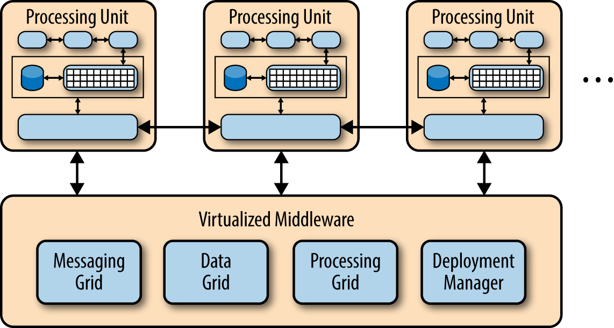
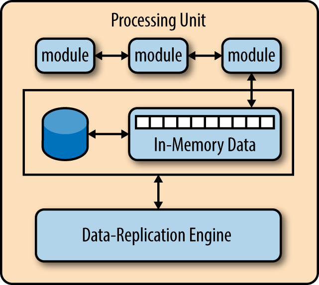
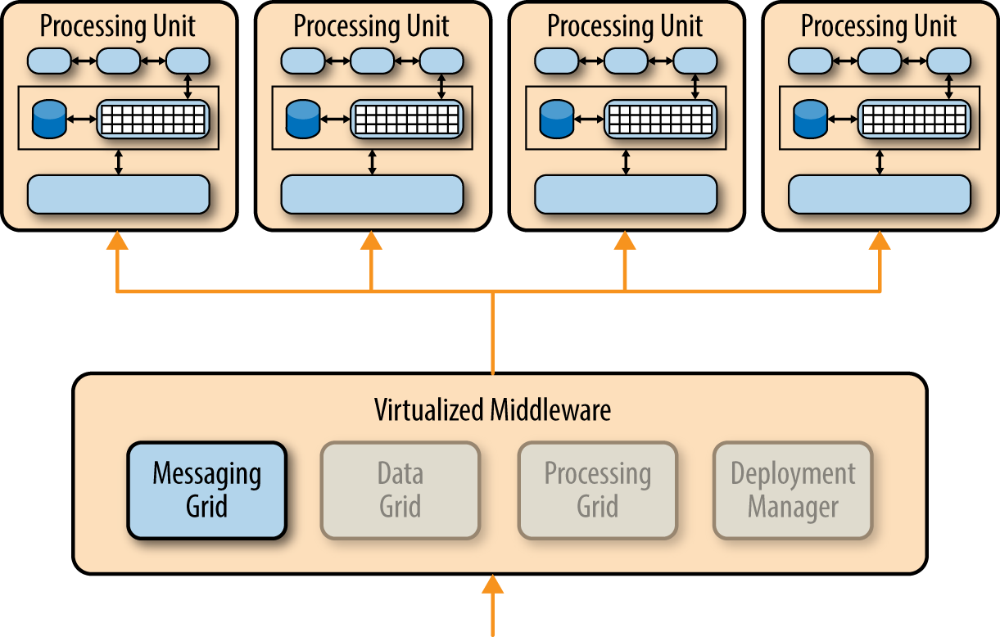
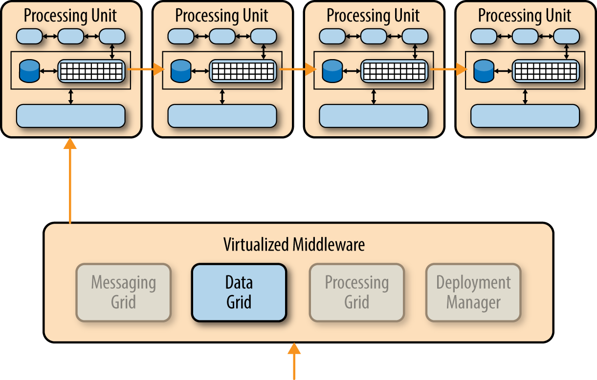
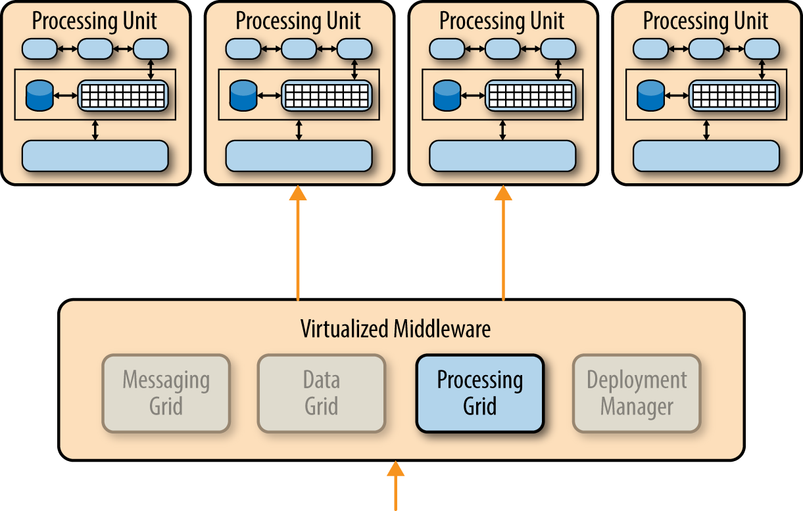

# 第五章 基于空间的架构 (Space-Based Architecture)

大多数基于 Web 的商业应用都遵循相同的请求流程：浏览器发出请求，然后到达 Web 服务器，接着是应用服务器，最后到达数据库服务器。这种模式在用户数量较少的情况下运行良好，但随着用户负载的增加，瓶颈开始出现，首先出现在 Web 服务器层，然后是应用服务器层，最后是数据库服务器层。应对用户负载增加导致的瓶颈的常用方法是横向扩展 Web 服务器。这种方法相对简单且成本低廉，有时确实可以解决瓶颈问题。然而，在大多数高用户负载的情况下，横向扩展 Web 服务器层只是将瓶颈转移到了应用服务器。扩展应用服务器比扩展 Web 服务器更复杂、成本更高，而且通常只是将瓶颈转移到了数据库服务器，而数据库服务器的扩展难度更大、成本更高。即使可以扩展数据库，最终也会形成一个三角形拓扑结构，三角形中最宽的部分是 Web 服务器（最容易扩展），而最小的部分是数据库（最难扩展）。

在任何具有极高并发用户负载的高流量应用程序中，数据库通常会成为限制并发事务处理数量的最终瓶颈。尽管各种缓存技术和数据库扩展产品有助于解决这些问题，但事实仍然是，为应对极端负载而扩展普通应用程序非常困难。

基于空间的架构模式专门用于解决可扩展性和并发性问题。对于并发用户量变化且不可预测的应用程序而言，它也是一种有效的架构模式。从架构层面解决极端且变化的可扩展性问题通常比尝试扩展数据库或将缓存技术改造到不可扩展的架构中更有效。

## 模式描述

基于空间的模式（有时也称为云架构模式）最大限度地减少了限制应用程序扩展的因素。该模式的名称来源于元组空间的概念，即分布式共享内存的思想。通过消除对中心数据库的依赖并使用复制的内存数据网格，可以实现高可扩展性。应用程序数据保存在内存中，并在所有活动的处理单元之间进行复制。处理单元可以根据用户负载的增减动态启动和关闭，从而实现可变扩展。由于没有中央数据库，因此消除了数据库瓶颈，从而在应用程序内部实现了近乎无限的扩展能力。

大多数符合这种模式的应用程序都是标准网站，它们接收来自浏览器的请求并执行某种操作。竞价拍卖网站就是一个很好的例子。该网站通过浏览器请求不断接收来自互联网用户的出价。应用程序会收到对特定商品的出价，记录该出价及其时间戳，更新该商品的最新出价信息，并将信息发送回浏览器。

这种架构模式包含两个主要组件：处理单元和虚拟化中间件。图 5-1 展示了基于空间的基本架构模式及其主要架构组件。

处理单元组件包含应用程序组件（或应用程序组件的一部分）。这包括基于 Web 的组件以及后端业务逻辑。处理单元的内容会根据应用程序的类型而有所不同——较小的 Web 应用程序通常会部署在单个处理单元中，而较大的应用程序则可能根据其功能区域将应用​​程序功能拆分到多个处理单元中。处理单元通常包含应用程序模块、内存数据网格以及用于故障转移的可选异步持久存储。它还包含一个复制引擎，虚拟化中间件使用该引擎将一个处理单元所做的数据更改复制到其他活动处理单元。

*Figure 5-1. Space-based architecture pattern*

虚拟化中间件组件负责系统维护和通信。它包含控制数据同步和请求处理各个方面的组件。虚拟化中间件包括消息网格、数据网格、处理网格和部署管理器。这些组件将在下一节中详细介绍，它们既可以自定义编写，也可以作为第三方产品购买。

## 模式动态

基于空间的架构模式的精髓在于每个处理单元中包含的虚拟化中间件组件和内存数据网格。图 5-2 展示了典型的处理单元架构，其中包含应用程序模块、内存数据网格、用于故障转移的可选异步持久化存储以及数据复制引擎。

虚拟化中间件本质上是架构的控制器，负责管理请求、会话、数据复制、分布式请求处理和处理单元部署。虚拟化中间件包含四个主要架构组件：消息网格、数据网格、处理网格和部署管理器。

*Figure 5-2. Processing-unit component*

### 消息网格

如图 5-3 所示，消息网格用于管理输入请求和会话信息。当请求到达虚拟化中间件组件时，消息网格组件会确定哪些活动处理组件可以接收该请求，并将请求转发给其中一个处理单元。消息网格的复杂程度可以从简单的轮询算法到更复杂的“下一个可用”算法不等，后者会跟踪哪个请求正在由哪个处理单元处理。

*Figure 5-3. Messaging-grid component*

### 数据网格

数据网格组件或许是此模式中最重要、最关键的组件。数据网格与每个处理单元中的数据复制引擎交互，以管理数据更新时处理单元之间的数据复制。由于消息网格可以将请求转发到任何可用的处理单元，因此每个处理单元的内存数据网格中必须包含完全相同的数据。尽管图 5-4 显示了处理单元之间的同步数据复制，但实际上它是并行异步完成的，而且速度非常快，有时只需几微秒（百万分之一秒）即可完成数据同步。

*Figure 5-4. Data-grid component*

### 处理网格

如图 5-5 所示，处理网格是虚拟化中间件中的一个可选组件，用于管理分布式请求处理。当存在多个处理单元时，每个处理单元负责处理应用程序的一部分。如果收到的请求需要不同类型处理单元（例如，订单处理单元和客户处理单元）之间的协调，则由处理网格来协调和处理这两个处理单元之间的请求。

*Figure 5-5. Processing-grid component*

### 部署管理器

部署管理器组件根据负载情况动态管理处理单元的启动和关闭。该组件持续监控响应时间和用户负载，并在负载增加时启动新的处理单元，在负载减少时关闭处理单元。它是实现应用程序可变扩展性的关键组件。

## 注意事项

基于空间的架构模式实现起来既复杂又昂贵。对于负载可变的小型 Web 应用程序（例如社交媒体网站、竞价和拍卖网站），它是一个不错的架构选择。但是，它并不适合具有大量操作数据的传统大型关系数据库应用程序。

虽然基于空间的架构模式不需要集中式数据存储，但通常会包含一个数据存储，用于执行初始内存数据网格加载以及异步持久化处理单元所做的数据更新。为了减少每个处理单元内存数据网格的内存占用，通常会创建单独的分区，将易失性强且常用的事务数据与非活动数据隔离。

值得注意的是，虽然这种模式的另一个名称是“基于云的架构”，但处理单元（以及虚拟化中间件）不必驻留在云端托管服务或 PaaS（平台即服务）上。它同样可以驻留在本地服务器上，这也是我更喜欢“基于空间的架构”这个名称的原因之一。

从产品实现的角度来看，您可以通过 GemFire、JavaSpaces、GigaSpaces、IBM Object Grid、nCache 和 Oracle Coherence 等第三方产品来实现此模式中的许多架构组件。由于此模式的实现成本和功能（尤其是数据复制时间）差异很大，因此作为架构师，您应该在选择任何产品之前，首先确定您的具体目标和需求。

## 模式分析

下表包含对空间架构模式常见架构特征的评级和分析。每个特征的评级基于该特征作为典型模式实现能力的自然倾向，以及该模式的普遍认知。如需了解此模式与本报告中其他模式的并排比较，请参阅本报告末尾的附录 A。

***整体敏捷性***
> *等级:* 高  
*分析:* 整体敏捷性是指快速响应不断变化的环境的能力。由于处理单元（应用程序的已部署实例）可以快速启动和关闭，因此应用程序能够很好地响应用户负载增加或减少（环境变化）带来的影响。采用这种模式创建的架构通常能够很好地应对代码变更，这得益于应用程序规模小和模式的动态特性。

***易于部署***
> *等级:* 高  
*分析:* 虽然基于空间的架构通常不是解耦和分布式的，但它们是动态的，而且复杂的基于云的工具使得应用程序可以轻松地“推送”到服务器，从而简化部署。

***可测试性***
> *等级:* 低  
*分析:* 在测试环境中实现非常高的用户负载既昂贵又耗时，这使得测试应用程序的可扩展性方面变得困难。

***性能***
> *等级:* 高  
*分析:* 这种模式通过内置的内存数据访问和缓存机制实现了高性能。

***可扩展性***
> *等级:* 高  
*分析:* 高可扩展性源于对集中式数据库的依赖性很小或没有依赖性，因此从根本上消除了可扩展性方程式中的这一限制瓶颈。

***易于开发***
> *等级:* 低  
*分析:* 复杂的缓存和内存数据网格产品使得这种模式的开发相对复杂，主要原因是人们对用于创建此类架构的工具和产品缺乏了解。此外，在开发此类架构时必须格外小心，以确保源代码中的任何内容都不会影响性能和可扩展性。

