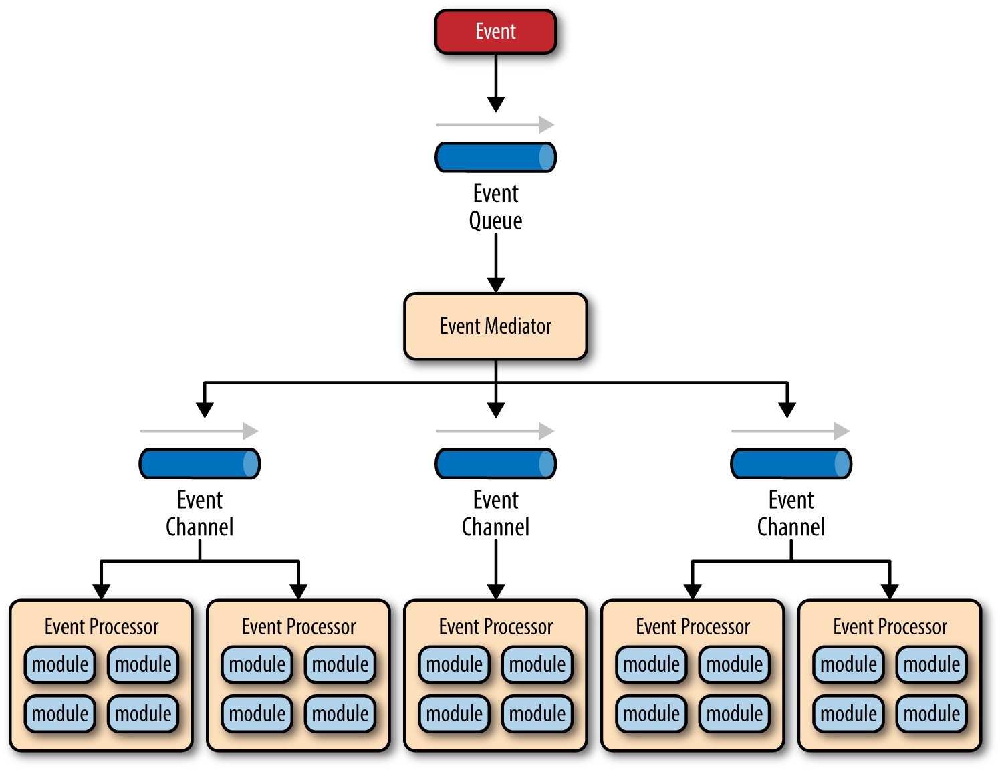
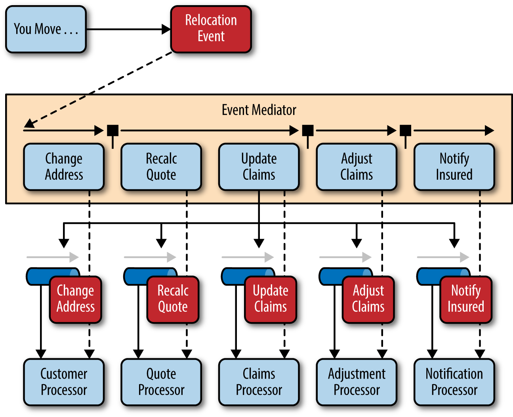
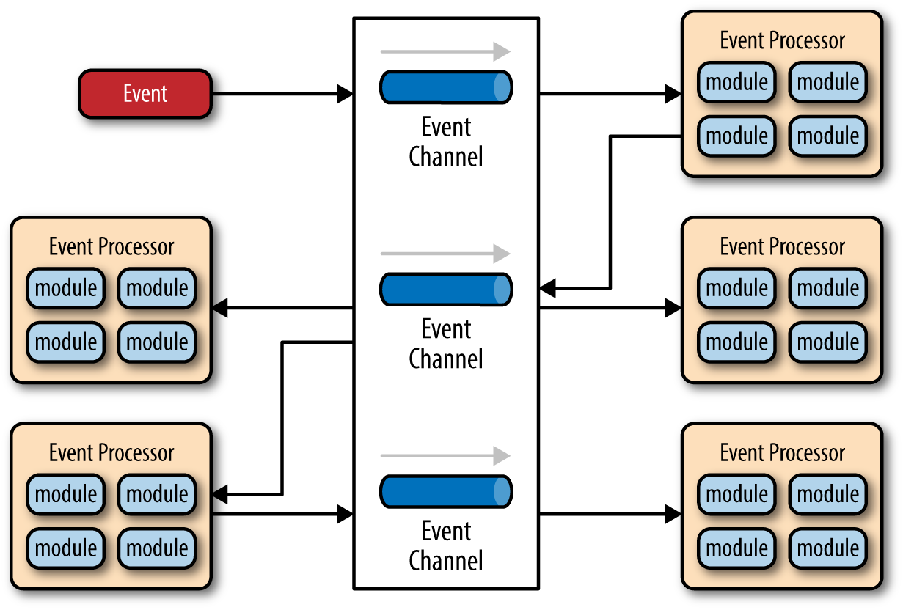
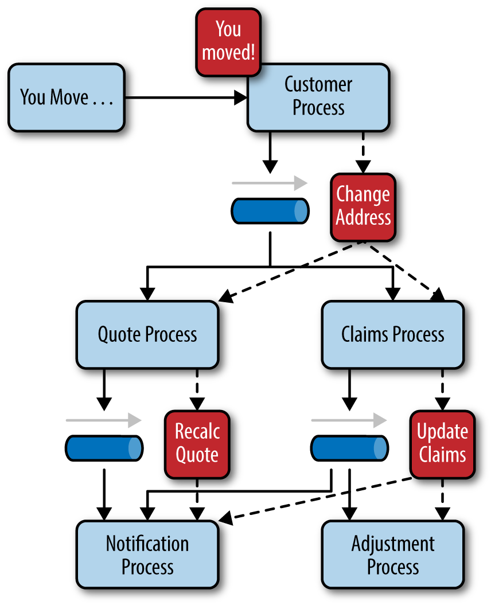

# CHAPTER 2 &emsp; Event-Driven Architecture

## Mediator Topology

*Figure 2-1. Event-driven architecture mediator topology*

## Broker Topology

*Figure 2-2. Mediator topology example*

*Figure 2-3. Event-driven architecture broker topology*

*Figure 2-4. Broker topology example*

## Considerations

## Pattern Analysis

